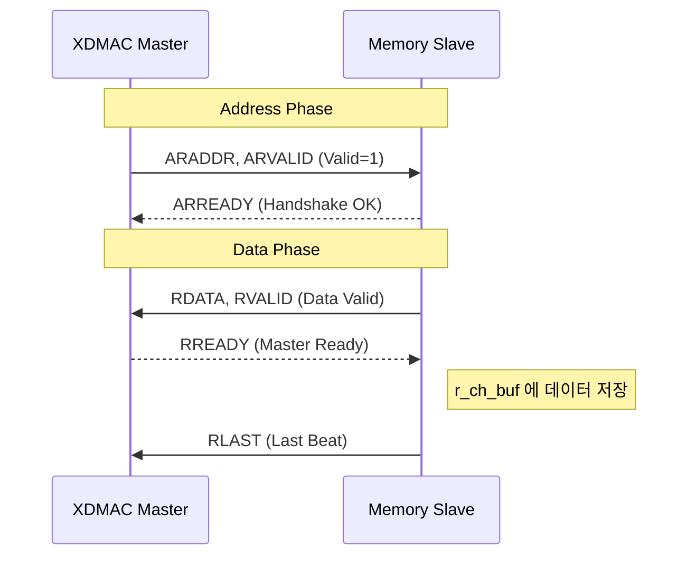
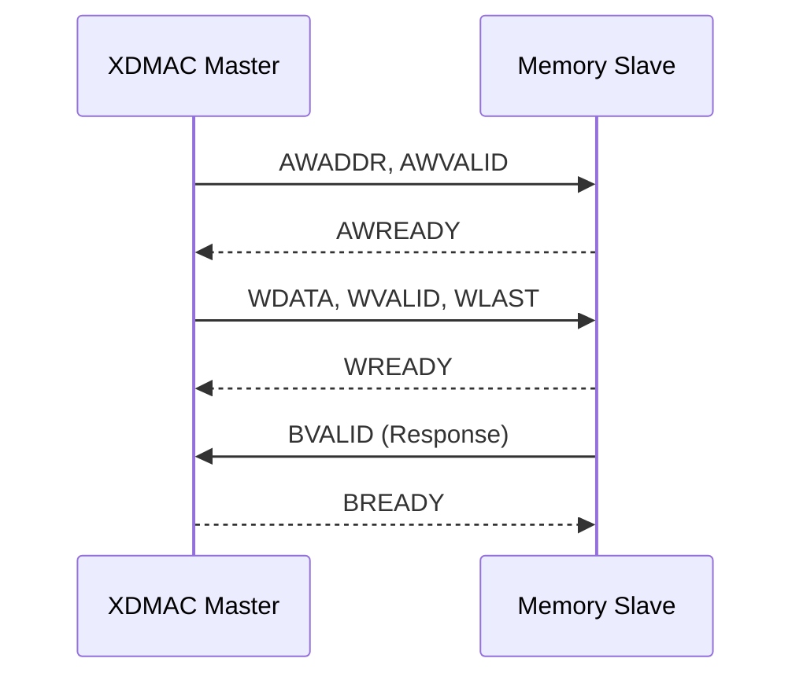

# Simple XDMA Example

고성능 SoC 시스템을 위한 **4채널 멀티태스킹 XDMA(Extended DMA) 컨트롤러** 설계 프로젝트입니다.  
이 프로젝트는 AMBA 3.0 규격을 준수하며, 특히 **Scatter-Gather**와 **우선순위 기반 가로채기(Preemption)** 기능에 초점을 맞추어 설계되었습니다.

---

## 🚀 주요 기능 (Features)

1.  **Multi-Channel & Fixed Priority:**
    *   4개의 독립된 채널(CH0~CH3)을 관리하며, 고정 우선순위(CH3 > CH2 > CH1 > CH0)를 적용합니다.
    *   **Arbitration:** 매 버스트 전송 종료 시마다 중재를 수행하여 높은 순위 채널에 즉시 버스를 양보합니다.
2.  **Scatter-Gather (SG) Engine:**
    *   메모리에 저장된 Descriptor(`{SRC, DST, LEN, NEXT}`)를 자동으로 로드하여 CPU 개입 없이 연속 전송을 수행합니다.
3.  **AXI4 128-bit Master Interface:**
    *   데이터 대역폭 극대화를 위해 128-bit 데이터 폭을 사용하며, 버스트 전송 핸드셰이크를 최적화했습니다.
4.  **Hardware Handshaking:**
    *   외부 IP로부터의 하드웨어 요청 신호(`i_hw_req`)를 즉각 감지하여 전송을 시작합니다.

---

## ⏱ 타이밍 및 핸드셰이크 분석

### 1. AXI4 Read Transaction (Descriptor & Data Fetch)
Descriptor를 읽거나 데이터를 소스 메모리에서 가져올 때의 타이밍입니다.


*   **Handshake:** `VALID`와 `READY`가 동시에 1인 시점에 데이터가 이동합니다.
*   **Memory Out:** 슬레이브 메모리는 `AR` 핸드셰이크 이후 다음 클럭에 데이터를 `RDATA`에 실어 보냅니다.

### 2. AXI4 Write Transaction (Data Store)
읽어온 데이터를 목적지 주소에 저장하는 과정입니다.


*   **Response (B):** 쓰기 작업은 반드시 `BVALID` 응답을 확인해야 해당 버스트가 종료된 것으로 간주하며, 중재기는 이 시점에 다음 채널을 결정합니다.

---

## 🔄 핵심 시나리오: Multi-channel Preemption

본 설계의 가장 강력한 기능인 **우선순위 기반 가로채기** 동작입니다.

### 시나리오 설명
1.  **T1:** CH0(낮은 순위)이 긴 데이터를 전송하기 시작합니다.
2.  **T2:** CH0의 첫 번째 버스트(Read-Write)가 진행됩니다.
3.  **T3:** CH3(최고 순위)의 HW 요청이 발생합니다.
4.  **T4:** Arbiter는 CH0의 현재 쓰기 응답(B Channel)이 완료되자마자 CH3에게 권한을 넘깁니다.
5.  **T5:** CH3이 Descriptor Fetch 및 데이터 전송을 완료합니다.
6.  **T6:** CH3 완료 후, CH0이 중단되었던 주소부터 다시 남은 전송을 재개합니다.

### 전송 재개 메커니즘 (Context Saving)
```text
[CH0 State] 
- curr_src: 0x0000 -> 0x0010 (16바이트 전송 후 업데이트)
- curr_len: 64 -> 48
- CH3 작업 중 CH0의 정보는 r_ch_curr_src[0] 등에 안전하게 보존됨
```

---

## 📂 파일 구조 (Project Structure)

*   `src/xdmac_top.v`: **Arbiter(중재자)** 및 각 채널의 상태 머신(FSM) 제어.
*   `src/xdmac_axi_master.v`: 공용 AXI 엔진. 단일 버스트 명령을 받아 핸드셰이크 수행.
*   `src/xdmac_apb_slave.v`: 4개 채널에 대한 레지스터 설정 인터페이스.
*   `tb/tb_xdmac.v`: 가상 메모리 모델 및 Preemption 시나리오 검증.
*   `run_sim.sh`: Icarus Verilog 컴파일 및 실행 자동화 스크립트.

---

## 🛠 실행 방법 (Usage)

```bash
# 1. 시뮬레이션 실행 및 로그 확인
./run_sim.sh

# 2. 파형 분석
gtkwave xdmac.vcd
```

## 📝 시뮬레이션 로그 예시
```text
[LOG 0] [DMA_TOP] CH0 Started (Direct Mode. SRC=0x0, DST=0x100, LEN=64)
[LOG 0] [DMA_TOP] Arbiter: Granting Bus to CH0
... (CH0 전송 중) ...
[LOG 0] [DMA_TOP] CH3 Started (Scatter-Gather Mode. Fetching Descriptor at 0x300)
[LOG 0] [DMA_TOP] Arbiter: Granting Bus to CH3 (CH0 가로채기 발생)
[LOG 0] [DMA_TOP] CH3 Transfer Fully Completed.
[LOG 0] [DMA_TOP] Arbiter: Granting Bus to CH0 (CH0 재개)
```
