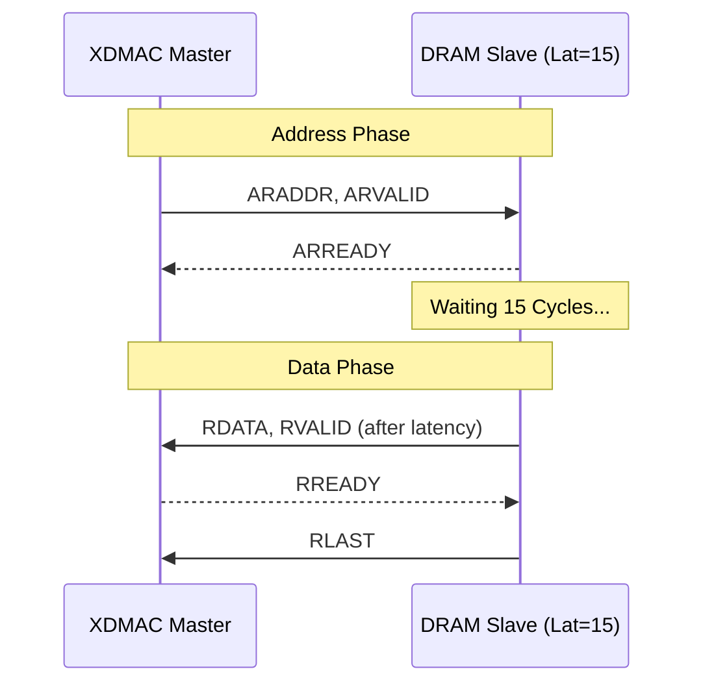
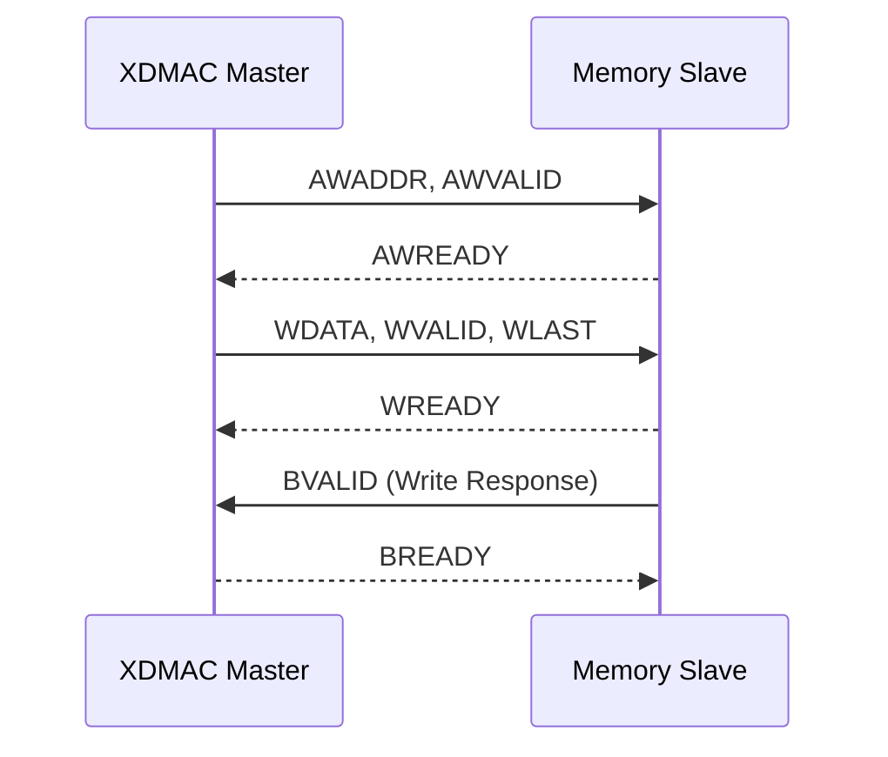

# Simple XDMA Subsystem with SRAM/DRAM Modeling

고성능 SoC 시스템을 위한 **4채널 멀티태스킹 XDMA(Extended DMA) 컨트롤러 및 메모리 서브시스템** 설계 프로젝트입니다.  
본 프로젝트는 SRAM(저지연)과 DRAM(고지연)이 혼재된 실제 하드웨어 환경을 시뮬레이션하며, 고정 우선순위 기반의 중재(Priority Arbitration)와 효율적인 데이터 전송을 검증합니다.

---

## 🚀 주요 기능 (Key Features)

1.  **Fixed Priority Arbitration:**
    *   4개의 독립 채널(CH0~CH3) 운영.
    *   **Priority:** CH3(최고) > CH2 > CH1 > CH0(최저).
    *   동시 요청 시 높은 순위의 채널이 먼저 버스를 점유하며, 매 버스트 완료 시 재중재(Re-arbitration)를 수행합니다.
2.  **Mixed Memory Latency Modeling:**
    *   **SRAM (Low Latency):** Latency 1 클럭의 즉각적인 응답.
    *   **DRAM (High Latency):** Latency 15~20 클럭의 지연 응답 시뮬레이션.
    *   이기종 메모리 간 전송(SRAM↔DRAM) 및 동일종 간 전송(SRAM↔SRAM, DRAM↔DRAM) 지원.
3.  **AXI4 128-bit Infrastructure:**
    *   1x4 AXI Interconnect를 통한 주소 기반 라우팅.
    *   128-bit 데이터 폭을 통한 대역폭 극대화.
4.  **Scatter-Gather (SG) Engine:**
    *   메모리 기반 Descriptor 구조를 통한 연속적인 데이터 처리 지원.

---

## 🏗 시스템 구조 (System Architecture)

```text
[ XDMAC Subsystem ]
      |
      |-- [ XDMAC Top ] (Arbiter & FSM)
      |      |-- [ APB Slave ] (Control Regs)
      |      |-- [ AXI Master ] (Bus Engine)
      |
      |-- [ AXI Interconnect 1x4 ] (Address Decoder)
             |
             |-- [ SRAM 0 ] (0x0000_0000, Latency: 1)
             |-- [ SRAM 1 ] (0x1000_0000, Latency: 1)
             |-- [ DRAM 0 ] (0x2000_0000, Latency: 15)
             |-- [ DRAM 1 ] (0x3000_0000, Latency: 20)
```

---

## ⏱ 기술적 분석 (Technical Analysis)

### 1. AXI4 Read Transaction (Mixed Latency Handling)
고지연 메모리(DRAM)로부터 데이터를 읽을 때, Master는 `RVALID`가 올 때까지 대기하며 핸드셰이크를 유지합니다.



### 2. AXI4 Write Transaction
쓰기 완료는 `BVALID` 응답을 통해 확인하며, 중재기는 이 시점을 버스 해제 및 재할당의 기준으로 삼습니다.



---

## 🔄 핵심 시뮬레이션 시나리오

### 시나리오 1: Priority Arbitration Storm
모든 채널(CH0~CH3)에 동시 전송 요청이 들어왔을 때, 설계된 우선순위에 따라 **CH3 → CH2 → CH1 → CH0** 순으로 처리됨을 검증합니다.

### 시나리오 2: Mixed & Same Type Transfers
*   **SRAM to SRAM:** 최소 지연 시간 전송.
*   **DRAM to DRAM:** 최대 지연 시간 환경에서의 버스 점유 유지.
*   **Cross Transfer:** SRAM↔DRAM 간 데이터 무결성 확인.

---

## 🛠 실행 및 검증 (Execution)

```bash
# 시뮬레이션 실행 (SystemVerilog 2012 지원)
./run_sim.sh
```

### 시뮬레이션 로그 (Priority Grant Order)
```text
[TEST] Case 2: Priority Arbitration Storm (CH0,1,2,3 Simultaneous)
[LOG] CH3 Started ...
[LOG] CH2 Started ...
[LOG] Arbiter: Granting Bus to CH3  <-- 최고 순위 우선 점유
[LOG] CH3 Transfer Fully Completed.
[LOG] Arbiter: Granting Bus to CH2  <-- 다음 순위 승계
...
--- Final Verification ---
CH3 Final Success!
CH2 Final Success!
...
```

---

## 📂 파일 구조 (Project Structure)

*   `src/xdmac_subsystem.v`: DMA-인터커넥트-메모리 통합 최상위 모듈.
*   `src/axi_interconnect_1x4.v`: 주소 디코딩 기반 요청 라우팅.
*   `src/axi_slave_mem.v`: 파라미터화된 지연 시간(Latency) 지원 메모리 모델.
*   `src/xdmac_top.v`: 우선순위 중재 및 채널 상태 관리.
*   `tb/tb_xdmac.v`: 복합 시나리오 검증용 테스트벤치.
